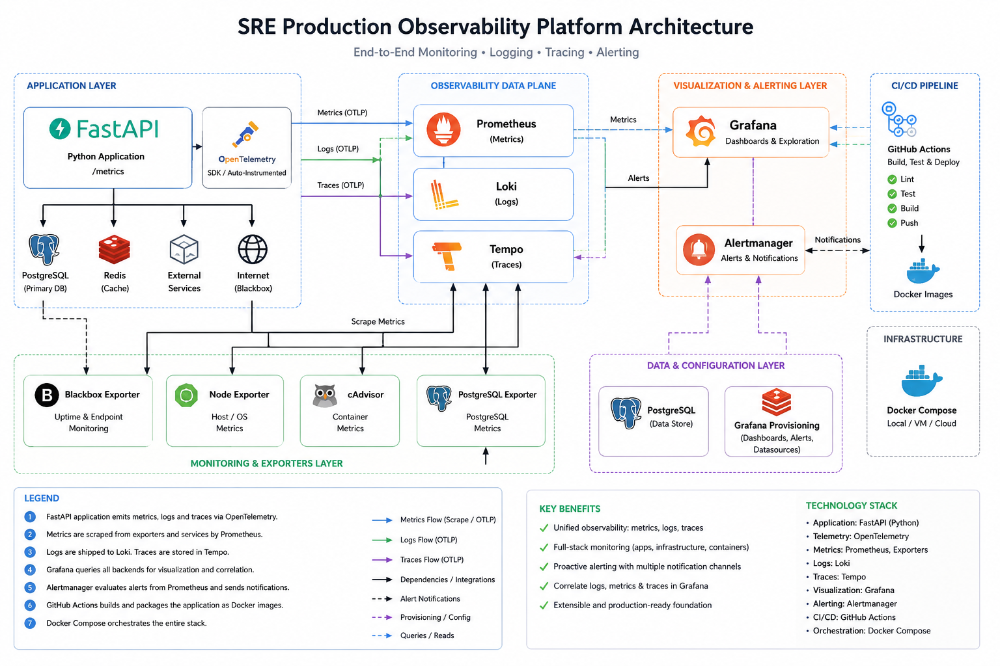
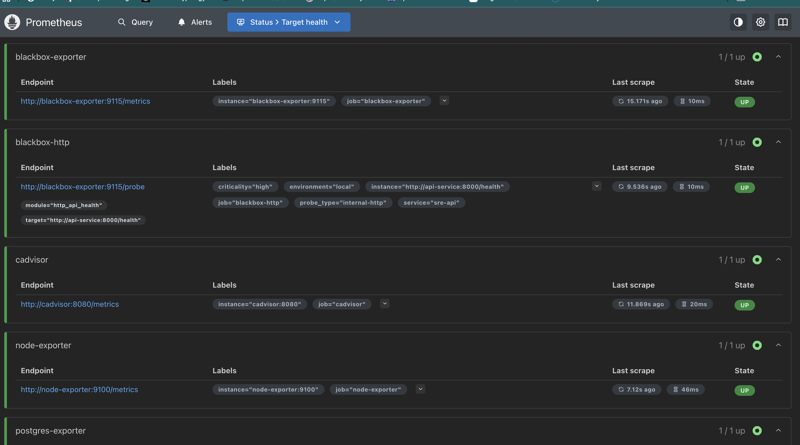
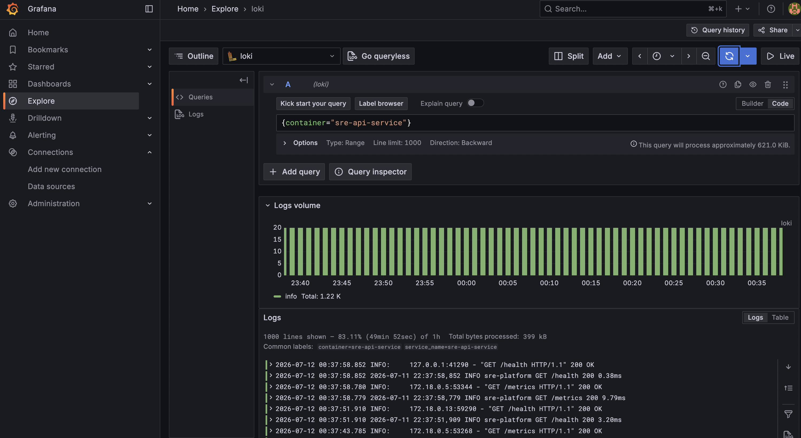
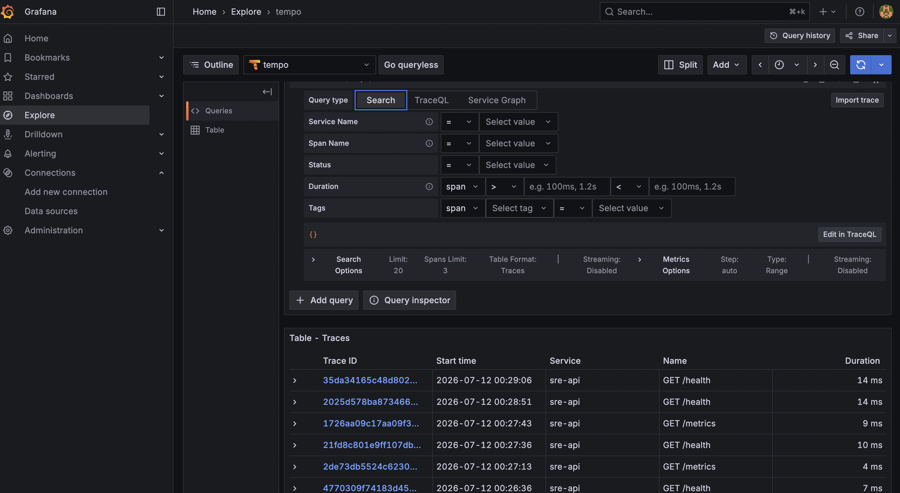
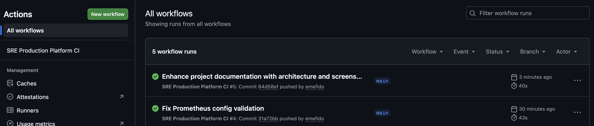

# Production-Grade SRE Observability Platform


> A production-style Site Reliability Engineering portfolio
> demonstrating monitoring, observability, distributed tracing,
> synthetic monitoring and CI/CD.

------------------------------------------------------------------------

# Executive Summary

This repository demonstrates how a production-style platform can be
designed, monitored, operated and continuously validated using modern
Site Reliability Engineering practices.

The platform focuses on **operations and observability**, building each
component incrementally and validating it before moving to the next
stage.

------------------------------------------------------------------------

# Architecture



------------------------------------------------------------------------

# Technology Stack

  Layer                  Technology
  ---------------------- -----------------------
  Application            FastAPI
  Database               PostgreSQL
  Cache                  Redis
  Metrics                Prometheus
  Visualization          Grafana
  Alerting               Alertmanager
  Logging                Loki + Promtail
  Distributed Tracing    Tempo + OpenTelemetry
  Synthetic Monitoring   Blackbox Exporter
  Container Metrics      cAdvisor
  Host Metrics           Node Exporter
  Database Metrics       PostgreSQL Exporter
  CI/CD                  GitHub Actions
  Runtime                Docker Compose

------------------------------------------------------------------------

# Platform Architecture

``` text
                    GitHub
                       │
              GitHub Actions CI
                       │
                       ▼
               Docker Compose
                       │
     ┌─────────────────┴─────────────────┐
     │                                   │
     ▼                                   ▼
 FastAPI API                     PostgreSQL
     │                                   │
     ├──────────── Metrics ───────────────┐
     ▼                                   ▼
 Prometheus                    PostgreSQL Exporter
     ▲
     ├── Node Exporter
     ├── cAdvisor
     ├── Blackbox Exporter
     ▼
 Grafana
 ▲        ▲
 │        │
Loki    Tempo
 ▲        ▲
 │        │
Promtail OpenTelemetry
```

------------------------------------------------------------------------

# Grafana Dashboard

The primary operational dashboard provides:

-   PostgreSQL Availability
-   Database Size
-   API Requests Per Second
-   Deadlocks
-   Connection Utilization
-   API p99 Latency


------------------------------------------------------------------------

# Prometheus Targets

Prometheus continuously scrapes:

-   FastAPI
-   PostgreSQL Exporter
-   Node Exporter
-   cAdvisor
-   Blackbox Exporter



------------------------------------------------------------------------

# Centralized Logging

Application logs are collected with Promtail and stored in Loki.

Engineers can:

-   Search logs
-   Filter by container
-   Investigate incidents
-   Correlate logs with metrics and traces



------------------------------------------------------------------------

# Distributed Tracing

Tracing is implemented with:

-   OpenTelemetry
-   OTLP
-   Tempo

Current traces include API requests such as `/health` and `/metrics`.



------------------------------------------------------------------------

# Continuous Integration

GitHub Actions validates every push by:

-   Validating Docker Compose
-   Validating Prometheus configuration
-   Building the application image



------------------------------------------------------------------------

# Repository Structure

``` text
.
├── .github/
├── apps/
├── automation/
├── docs/
├── platform/
├── scripts/
├── docker-compose.yml
└── README.md
```

------------------------------------------------------------------------

# Quick Start

``` bash
git clone https://github.com/emefido/sre-production-platform.git
cd sre-production-platform
docker compose up -d
```

------------------------------------------------------------------------

# Skills Demonstrated

-   Site Reliability Engineering
-   Observability
-   Monitoring
-   Alerting
-   Distributed Tracing
-   Centralized Logging
-   Synthetic Monitoring
-   Docker
-   GitHub Actions
-   CI/CD
-   PostgreSQL Monitoring
-   Reliability Engineering

------------------------------------------------------------------------

# Roadmap

-   Kubernetes
-   Helm
-   Argo CD
-   Chaos Engineering
-   SLO/Error Budget reporting
-   Load testing
-   Terraform deployment

------------------------------------------------------------------------

# License

Educational and portfolio purposes.
